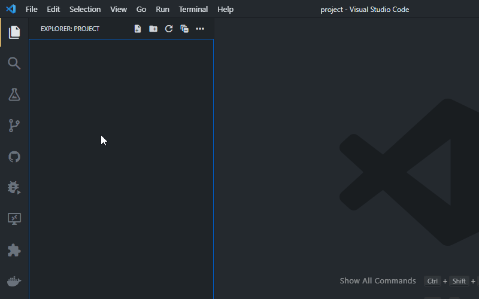

# create-python-module

Duplicates the useful functionality in PyCharm whereby you can create a
directory and populate it with an `__init__.py` file with one command.

## Installation

Search on the VSCode extentions tab or Web Marketplace for
'create-python-module' and click install.

## Usage

Simply right click on a folder in the File Explorer and chose "New Python
Module" from the context menu. Enter a name when prompted, and a folder with
that name will be created where you chose, containing an empty `__init__.py`
file. You can also create a nested module by simply specifing the folder path as
such. For example, selecting the `work` folder and entering `deep/nested/module`
would create a module in `work/deep/nested/module` with the contents
`__init__.py`.

## TODO

This is a very basic extension, simply to give me a start on creating
extensions for VSCode while filling a serious lack I find in VSCode. It is
missing :

- Tests
- Error Checking

## Requirements

Just VSCode.

## Extension Settings

None.

## Known Issues

None known (yet)

## Release Notes

### 0.0.x

Initial Internal testing Releases.

### 1.0.0

First public release.

### 1.0.1

Documentation Update only
